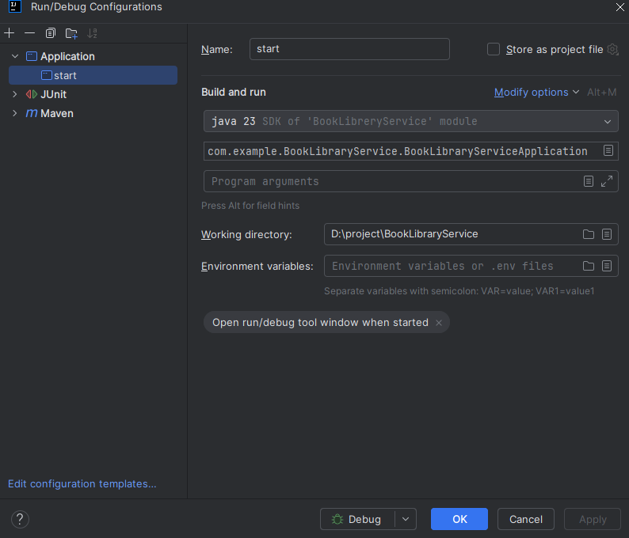

# 📚 Book Library Service (POC)

โปรเจคเรียบง่ายสำหรับการเขียน API ด้วย spring boot จะไปเน้นในการหยิบยืมใช้ หรือ ใช้ทดสอบทดลอง framework บางอย่างทำงานยังไง เช่น ในที่นี้มีการนำ
flyway มาจัดการปัญหาการ update ข้อมูล sql เพื่อให้เราทราบได้ว่ามีการแก้ไขหรือเปลี่ยนแปลง version อะไร

จะไม่จำเป็นต้อง install docker

kafka หรือ redis ไม่ได้อยู่ในนี้ แต่อยู๋ใน repository อื่น

---

🛠️ ขั้นตอนการติดตั้งฐานข้อมูล (Database Setup)
- อย่าลืมสร้าง DB พื้นฐานด้วย MySQL 8.x สามารถใช้ Mysql workbench ได้เลยเป็น best practice และ การ set up service หรือ mysql server ที่ถูกต้องที่สุด
- อย่าลืมที่สร้าง schema ไว้ด้วยในที่นี้ให้เช็ค schema ที่ให้ดูที่ application-___.yaml สำหรับการแยก environment ในการพัฒนา ***เดี๋ยวจะลงผิดถังเอา
- คุณไม่จำเป็นต้องไล่รัน script database เองสักอย่าง เพราะ นี่คือโปรเจคที่ DB Script จะรัน และ manual เช็คให้ทุกอย่างแล้วโดยไปดูที่
  flyway_schema_history ได้เลย

---
🧪 การรัน Integration Tests 

ถ้าโปรเจค impact หรือ เกิดการแก้ไขแต่ไม่บอกก็จะได้เห็นใน test เองก็ควรจะเขียน test ให้ครบทุกเส้น หรือ coverage all ไปเลยจะได้รู้ว่าอะไรกระทบ
- รัน Test ทั้งหมด: Bash ./mvnw test
- ถ้าถนัด mvn command ก็ mvn test 
- ดูที่ explorer มองหา test/java/_______ นั่นคือตำแหน่งของไฟล์เทสแต่ละไฟล์ถ้าต้องการรันแยกแต่ละตัว

---
🚀 Getting Started (local)

Java 21 ตามที่ระบุใน pom.xml อย่าลืม JAVA/HOME ด้วยนะ

Maven 3.x

---

📮 Postman Collection
- get book

  curl --location --request GET 'http://localhost:8082/book?author=%E0%B8%AA%E0%B8%A1%E0%B8%8A%E0%B8%B2%E0%B8%A2%20%E0%B8%AA%E0%B8%B2%E0%B8%A2%E0%B9%82%E0%B8%84%E0%B9%89%E0%B8%94' \
  --header 'Authorization: Bearer your-token' \
  --header 'Accept: application/json' \
  --header 'Content-Type: application/json' \
  --data '{}'

- save book

  curl --location 'http://localhost:8082/book' \
  --header 'Authorization: Bearer your-token' \
  --header 'Accept: application/json' \
  --header 'Content-Type: application/json' \
  --data '{
  "title": "Clean Code",
  "author": "Robert C. Martin",
  "publishedDate": "2551-08-01"
  }'

